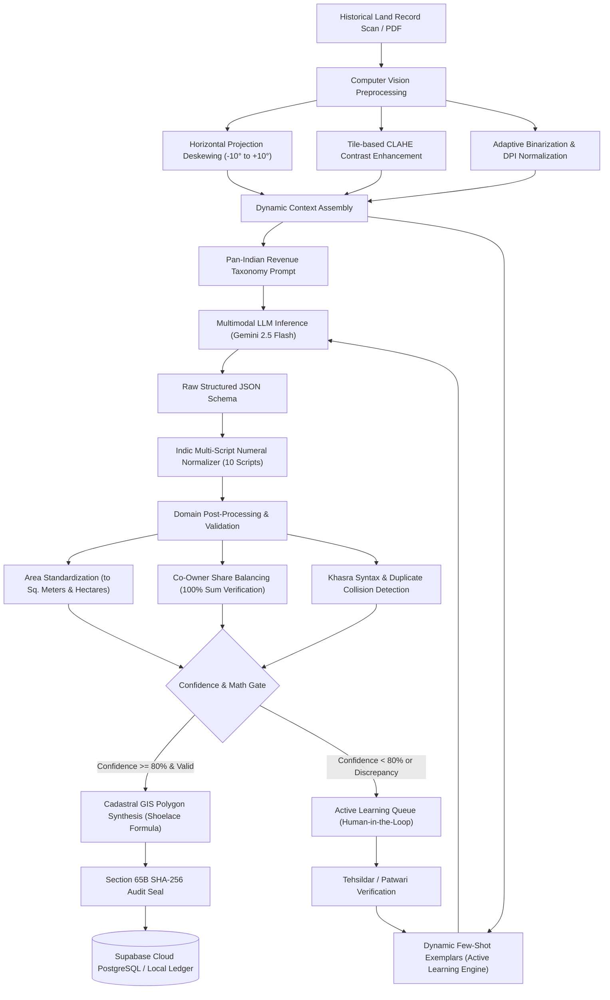

# भूमिदृष्टि (BhoomiDrishti AI)
### AI-Powered Legacy Land Record Digitization, Validation, and Cadastral GIS Platform
**Smart India Hackathon (SIH 2026) | Team Data_Vasu**  
*Aligned with the Digital India Land Records Modernization Programme (DILRMP), Department of Land Resources (DoLR), Ministry of Rural Development, Government of India.*

[](https://opensource.org/licenses/Apache-2.0)
[](https://www.python.org/)
[](https://fastapi.tiangolo.com/)
[](https://react.dev/)
[](https://supabase.com/)
[](https://aistudio.google.com/)

---

## 📑 Table of Contents
1. [Overview & Problem Statement](#-overview--problem-statement)
2. [System Architecture](#-system-architecture)
3. [Key Innovations & Capabilities](#-key-innovations--capabilities)
4. [Deployment Guide (Zero-Code Ready)](#-deployment-guide-zero-code-ready)
   - [Deploying Backend on Render](#1-deploying-backend-on-render)
   - [Deploying Frontend on Vercel](#2-deploying-frontend-on-vercel)
   - [Connecting Supabase Cloud Database](#3-connecting-supabase-cloud-database)
5. [Local Development Quickstart](#-local-development-quickstart)
6. [REST API Specification](#-rest-api-specification)
7. [Repository Structure](#-repository-structure)
8. [License & Attribution](#-license--attribution)

---

## 🏛️ Overview & Problem Statement

Millions of historical land records across India—including **Khasra, Khatauni, Jamabandi, 7/12 Saat-Bara, Patta, Pahani, Adangal, and Registry Deeds**—exist only as yellowed, water-stained, torn, and folded paper documents. Many are written in regional Indian scripts with archaic revenue nomenclature, non-standard measurement units (Bigha, Guntha, Biswa, Kanal, Marla), and complex co-ownership fractions.

**BhoomiDrishti AI** is an enterprise-grade, sovereign digitization platform that solves this challenge end-to-end:
- **Optical Restoration**: Digitally rescues 50+ year-old degraded scans via computer vision.
- **Multimodal AI OCR**: Transcribes and extracts structured entities using Google Gemini 2.5 Flash across all 22 Eighth Schedule Indian languages.
- **10-Script Indic Numeral Normalizer**: Standardizes regional native digits into universal Arabic numerals.
- **Automated Mathematical Validation**: Enforces that co-owner shares strictly total 100% and converts regional land units to base Square Meters and Hectares.
- **Automated Cadastral GIS Synthesis**: Reconstructs exact parcel polygons using the Gauss Shoelace Formula and maps them onto Esri Satellite layers.
- **Active Learning Loop**: Dynamically injects revenue officer corrections into subsequent model prompts as few-shot exemplars.
- **Section 65B Audit Trail**: Seals every extraction with a tamper-evident SHA-256 cryptographic signature compliant with the Indian Evidence Act, synchronizing live with Supabase cloud PostgreSQL.

---

## 📐 System Architecture



---

## 🌟 Key Innovations & Capabilities

### 1. Degraded Document Computer Vision Restoration (`preprocessing.py`)
- **Horizontal Projection Profile Deskewing**: Rotates skewed scans across $-10.0^\circ$ to $+10.0^\circ$ at $0.5^\circ$ increments, identifying the angle with maximum text-row profile variance.
- **Pure NumPy Tile-based CLAHE**: Applies Contrast Limited Adaptive Histogram Equalization ($8 \times 8$ grid, clip limit $2.5$) to rescue faint ballpoint and fountain-pen ink strokes without blowing out paper background fibers.

### 2. Multi-Script Indic Numeral Normalization (`ai_extractor.py`)
Automatically translates native regional digits from 10 scripts into standard Arabic digits (0–9), enabling database indexing and accurate math validation:
- **Devanagari**: `० १ २ ३ ४ ५ ६ ७ ८ ९` $\rightarrow$ `0 1 2 3 4 5 6 7 8 9`
- **Bengali & Assamese**: `০ ১ ২ ৩ ৪ ৫ ৬ ৭ ৮ ৯` $\rightarrow$ `0 1 2 3 4 5 6 7 8 9`
- **Odia**: `୦ ୧ ୨ ୩ ୪ ୫ ୬ ୭ ୮ ୯` $\rightarrow$ `0 1 2 3 4 5 6 7 8 9`
- **Telugu**: `౦ ౧ ౨ ౩ ౪ ౫ ౬ ౭ ౮ ౯` $\rightarrow$ `0 1 2 3 4 5 6 7 8 9`
- **Tamil**: `௦ ௧ ௨ ௩ ௪ ௫ ௬ ௭ ௮ ௯` $\rightarrow$ `0 1 2 3 4 5 6 7 8 9`
- **Kannada**: `೦ ೧ ೨ ೩ ೪ ೫ ೬ ೭ ೮ ೯` $\rightarrow$ `0 1 2 3 4 5 6 7 8 9`
- **Gujarati**: `૦ ૧ ૨ ૩ ૪ ૫ ૬ ૭ ૮ ૯` $\rightarrow$ `0 1 2 3 4 5 6 7 8 9`
- **Gurmukhi (Punjabi)**: `੦ ੧ ੨ ੩ ੪ ੫ ੬ ੭ ੮ ੯` $\rightarrow$ `0 1 2 3 4 5 6 7 8 9`
- **Malayalam**: `൦ ൧ ൨ ൩ ൪ ൫ ൬ ൭ ൮ ൯` $\rightarrow$ `0 1 2 3 4 5 6 7 8 9`
- **Perso-Arabic (Urdu)**: `۰ ۱ ۲ ۳ ۴ ۵ ۶ ۷ ۸ ۹` $\rightarrow$ `0 1 2 3 4 5 6 7 8 9`

### 3. Automated Business Rules & Mathematical Balancing (`validation.py`)
- **Co-Owner Share Balancing**: Ensures fractional co-owner shares sum strictly to $100.0\%$. Discrepancies are automatically detected, flagged, and balanced across named heirs.
- **Area Standardization**: Standardizes historical regional units (Bigha, Guntha, Biswa, Kanal, Marla, Acres) to base **Square Meters** and **Hectares**.
- **Khasra Syntax & Duplicate Detection**: Cross-references existing database entries to prevent duplicate survey registrations in the same village.

### 4. Cadastral GIS & Polygon Geometry (`gis_service.py`)
- Resolves geographic center coordinates via hierarchical geocoding across all 28 Indian States and 8 UTs.
- Calculates local geodesic projection factors (`meters_per_degree_lat` and `meters_per_degree_lng`).
- Computes enclosed parcel surface area using the **Gauss Shoelace Formula** and scales vertices so the mapped polygon matches the documented metric area with zero mathematical drift.
- Computes exact perimeter lengths in meters for all boundary directions (North, South, East, West) and exports standard GeoJSON `FeatureCollection` objects.

### 5. Active Learning & Section 65B Evidentiary Audit Trail (`learning_engine.py`)
- Low confidence extractions ($< 80\%$) route to the **Active Learning Queue**.
- Human revenue officer edits are saved and injected into subsequent Gemini prompts as dynamic few-shot training exemplars.
- Every transaction is sealed with a **SHA-256 cryptographic hash**:
  $$\text{Seal} = \text{SHA-256}(\text{record\_id} \parallel \text{action} \parallel \text{timestamp} \parallel \text{details} \parallel \text{"DILRMP-GOV-IN"})$$
- Certified under Section 65B of the Indian Evidence Act, 1872 for legal admissibility in revenue courts.

### 6. Multilingual UI Localization & Government Design System
- Full native translation across **English, Hindi, Telugu, and Odia**.
- Follows National Portal of India guidelines: Lion Capital emblem, Ashoka blue palette, high-contrast dark mode, and font-scale controls (`A-`, `A`, `A+`).

---

## 🚀 Deployment Guide (Zero-Code Ready)

The repository is configured for immediate zero-code deployment: **Render** hosts the FastAPI backend, **Vercel** hosts the React frontend, and **Supabase** provides the PostgreSQL database.

### 1. Deploying Backend on Render

1. Create a free account on [Render](https://render.com).
2. Click **New +** $\rightarrow$ **Blueprint** (or **Web Service**).
3. Connect your GitHub repository.
4. Render will auto-detect `render.yaml` with the following configuration:
   - **Root Directory**: `backend`
   - **Build Command**: `pip install -r requirements.txt`
   - **Start Command**: `uvicorn app.main:app --host 0.0.0.0 --port $PORT`
   - **Health Check Path**: `/api/health`
5. In the Render Dashboard, add your Environment Variables under **Environment**:
   - `GEMINI_API_KEY`: Your Google AI Studio API key (obtain free at [aistudio.google.com](https://aistudio.google.com)).
   - `SUPABASE_URL`: Your Supabase Project URL (`https://<project-id>.supabase.co`).
   - `SUPABASE_KEY`: Your Supabase `anon public` or `service_role` key.
   - `GEMINI_MODEL`: `gemini-2.5-flash`
6. Click **Deploy**. Once deployed, copy your service URL (e.g. `https://bhoomidrishti-backend.onrender.com`).

---

### 2. Deploying Frontend on Vercel

1. Create a free account on [Vercel](https://vercel.com).
2. Click **Add New...** $\rightarrow$ **Project**.
3. Import your GitHub repository.
4. Configure Project Settings:
   - **Framework Preset**: `Vite` (auto-detected).
   - **Root Directory**: Click edit and select `frontend`.
   - **Build Command**: `npm run build`
   - **Output Directory**: `dist`
5. Expand **Environment Variables** and add:
   - **Key**: `VITE_API_URL`
   - **Value**: `https://your-backend-service.onrender.com` (your Render URL from Step 1).
6. Click **Deploy**. Vercel will build and serve your site globally via its edge CDN!

> [!TIP]
> **Live API URL Switching in UI**: If you deploy the frontend first before setting up Render, open the platform, click the **Supabase / Cloud Status** button in the header, and paste your Render URL directly into the **Backend API Endpoint** input field. It saves to your browser's local storage instantly without requiring a redeployment!

---

### 3. Connecting Supabase Cloud Database

1. Sign up on [Supabase](https://supabase.com) and create a free project.
2. Go to **SQL Editor** in Supabase and run the following schema migration script:

```sql
-- 1. Main Land Records Table
CREATE TABLE IF NOT EXISTS land_records (
    id TEXT PRIMARY KEY,
    document_type TEXT,
    state TEXT,
    district TEXT,
    tehsil TEXT,
    village TEXT,
    pargana TEXT,
    patwari_halka TEXT,
    khasra_number TEXT,
    khata_number TEXT,
    khewat_number TEXT,
    area_value DOUBLE PRECISION,
    area_unit TEXT,
    area_sq_meters DOUBLE PRECISION,
    standardized_hectares DOUBLE PRECISION,
    land_classification TEXT,
    soil_type TEXT,
    primary_owner TEXT,
    verification_status TEXT DEFAULT 'VALIDATED',
    confidence_score DOUBLE PRECISION DEFAULT 0.90,
    created_at TIMESTAMPTZ DEFAULT NOW(),
    verified_by TEXT DEFAULT 'Tehsildar'
);

-- 2. Landowners & Co-Owners Sub-table
CREATE TABLE IF NOT EXISTS record_landowners (
    id BIGSERIAL PRIMARY KEY,
    record_id TEXT REFERENCES land_records(id) ON DELETE CASCADE,
    name TEXT,
    relation TEXT,
    share_fraction TEXT,
    share_percentage DOUBLE PRECISION,
    gender TEXT,
    caste_category TEXT,
    aadhaar_masked TEXT
);

-- 3. Section 65B Cryptographic Audit Events Table
CREATE TABLE IF NOT EXISTS audit_events (
    id TEXT PRIMARY KEY,
    record_id TEXT,
    action TEXT,
    actor TEXT,
    details TEXT,
    sha256_signature TEXT,
    timestamp TIMESTAMPTZ DEFAULT NOW()
);
```

3. Copy your **Project URL** and **API Key** from **Project Settings $\rightarrow$ API** and paste them into your Render backend environment variables.

---

## 💻 Local Development Quickstart

### Prerequisites
- Node.js 18+ & npm
- Python 3.10+

### Option A: One-Click Startup (Windows)
Double-click `start_servers.bat` in the root directory. It launches both the FastAPI backend on port 8000 and the Vite frontend on port 5173. To terminate, run `stop_servers.bat`.

### Option B: Manual Terminal Startup

**Terminal 1 — Backend:**
```bash
cd backend
python -m venv venv
# On Windows:
.\venv\Scripts\activate
# On Linux/macOS:
# source venv/bin/activate

pip install -r requirements.txt
python run.py
```
*Backend runs at `http://127.0.0.1:8000` (Swagger docs at `/docs`).*

**Terminal 2 — Frontend:**
```bash
cd frontend
npm install
npm run dev
```
*Frontend runs at `http://localhost:5173`.*

---

## 📡 REST API Specification

| Method | Endpoint | Description |
| :--- | :--- | :--- |
| `GET` | `/api/health` | Service health status and database connection state |
| `GET` | `/api/config` | Supported languages and platform feature flags |
| `POST` | `/api/preprocess` | CLAHE enhancement, deskewing, and binarization |
| `POST` | `/api/extract` | Gemini Multimodal Vision extraction & Indic normalization |
| `POST` | `/api/validate` | Automated DILRMP business rules and share checks |
| `GET` | `/api/records` | Query all digitized land records with filters |
| `POST` | `/api/records` | Commit validated record to database with SHA-256 seal |
| `PUT` | `/api/records/{id}` | Update existing record with field-level change logging |
| `DELETE` | `/api/records/{id}` | Remove record from cloud database and sovereign ledger |
| `GET` | `/api/records/{id}/geojson` | Export parcel boundary as standard GeoJSON |
| `GET` | `/api/records/{id}/dilrmp` | Export record in National DILRMP XML/JSON format |
| `GET` | `/api/audit-trail` | Retrieve Section 65B cryptographic audit events |
| `DELETE` | `/api/audit-trail/{id}` | Delete individual audit trail entry |
| `POST` | `/api/audit-trail/batch-delete`| Delete multiple audit trail entries |
| `POST` | `/api/learning/correction` | Submit human officer correction to active learning engine |
| `GET` | `/api/learning/stats` | Continuous learning statistics and accuracy lift metrics |
| `GET` | `/api/database/status` | Real-time Supabase cloud sync status and row counts |
| `POST` | `/api/database/sync` | Trigger manual bi-directional Supabase cloud synchronization |

---

## 📂 Repository Structure

```
SIH 2026/
├── backend/
│   ├── app/
│   │   ├── ai_extractor.py       # Gemini Vision extraction & 10 Indic script numeral normalizer
│   │   ├── config.py             # Environment configurations & cloud host bindings
│   │   ├── database.py           # Supabase cloud sync & local JSON ledger fallback
│   │   ├── gis_service.py        # Real geocoding & Gauss Shoelace Cadastral polygon generator
│   │   ├── learning_engine.py    # Active learning few-shot engine & Section 65B SHA-256 seals
│   │   ├── main.py               # FastAPI REST router, PDFium processor & CORS
│   │   ├── preprocessing.py      # CLAHE, projection profile deskewing & Sauvola thresholding
│   │   ├── sample_records.py     # Authentic state revenue records (MP, MH, UP, BR, HR)
│   │   └── validation.py         # 100% co-owner share balancing & Khasra syntax rules
│   ├── data/                     # Persistent sovereign ledger files (audit_log, land_records)
│   ├── uploads/                  # Temporary file upload cache
│   ├── processed/                # Enhanced image preview cache
│   ├── .env.example              # Backend environment template
│   ├── Procfile                  # Cloud web process entrypoint
│   ├── requirements.txt          # Python cloud dependencies (FastAPI, PyPDFium2, Pillow, Gunicorn)
│   └── run.py                    # Server entrypoint with dynamic cloud port detection
│
├── frontend/
│   ├── public/                   # Favicon and government vector insignia
│   ├── src/
│   │   ├── components/
│   │   │   ├── ActiveLearningQueue.jsx  # HITL correction queue & AI accuracy analytics
│   │   │   ├── ApiKeyModal.jsx          # Live Gemini API key switcher
│   │   │   ├── AuditTrailModal.jsx      # Per-record audit trail modal
│   │   │   ├── AuditTrailView.jsx       # Global Section 65B audit log & batch deletion
│   │   │   ├── CadastralMap.jsx         # Interactive Leaflet map with satellite layers
│   │   │   ├── Dashboard.jsx            # State metrics, digitization progress & charts
│   │   │   ├── DigitizationStudio.jsx   # Split-screen scan viewer, presets & extraction flow
│   │   │   ├── DocumentViewer.jsx       # High-zoom document viewer with interactive slider
│   │   │   ├── FAQView.jsx              # Official FAQ & revenue terminology guide
│   │   │   ├── GovHeader.jsx            # National emblem header, language & role selector
│   │   │   ├── Navigation.jsx           # Top navigation bar
│   │   │   ├── RecordsRegistry.jsx      # Searchable registry, certificate printing & CRUD
│   │   │   ├── ReportsView.jsx          # Official DILRMP revenue intelligence reports
│   │   │   ├── SupabaseModal.jsx        # Cloud database sync & live backend URL configuration
│   │   │   └── VerificationForm.jsx     # Structured form with confidence indicators & math checks
│   │   ├── utils/
│   │   │   ├── areaUnits.js             # Land measurement unit conversion factors
│   │   │   └── translations.js          # Full native translations (EN, HI, TE, OR)
│   │   ├── config.js                    # Dynamic API client resolving Vercel/Render endpoints
│   │   ├── App.jsx                      # Root application component
│   │   ├── index.css                    # High-contrast accessible design system & dark mode
│   │   └── main.jsx                     # Application bootstrap
│   ├── .env.example                     # Frontend environment template
│   ├── package.json                     # Frontend dependencies (React 19, Leaflet, Lucide)
│   ├── vercel.json                      # Vercel deployment configuration with SPA routing
│   └── vite.config.js                   # Rollup vendor code-splitting & local proxy
│
├── sample_documents/                    # High-fidelity historic land record samples (MP, MH, CG, HR)
├── .gitignore                           # Production git exclusions for clean deployment
├── LICENSE                              # Apache License 2.0
├── README.md                            # Comprehensive platform documentation
├── render.yaml                          # Render Infrastructure-as-Code Blueprint
├── start_servers.bat                    # Windows one-click startup launcher
└── stop_servers.bat                     # Windows one-click process termination script
```

---

## 📜 License & Attribution

Copyright 2026 **Team Data_Vasu (Smart India Hackathon 2026)**.

Licensed under the **Apache License, Version 2.0** (the "License"); you may not use this file except in compliance with the License. You may obtain a copy of the License at:

[http://www.apache.org/licenses/LICENSE-2.0](http://www.apache.org/licenses/LICENSE-2.0)

Unless required by applicable law or agreed to in writing, software distributed under the License is distributed on an "AS IS" BASIS, WITHOUT WARRANTIES OR CONDITIONS OF ANY KIND, either express or implied. See the [LICENSE](LICENSE) file for the specific language governing permissions and limitations under the License.
